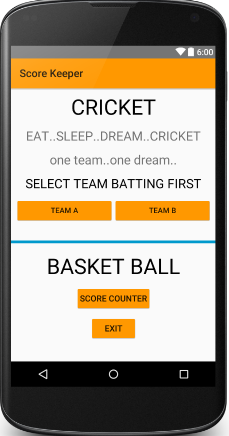
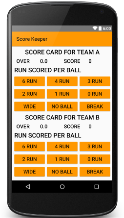
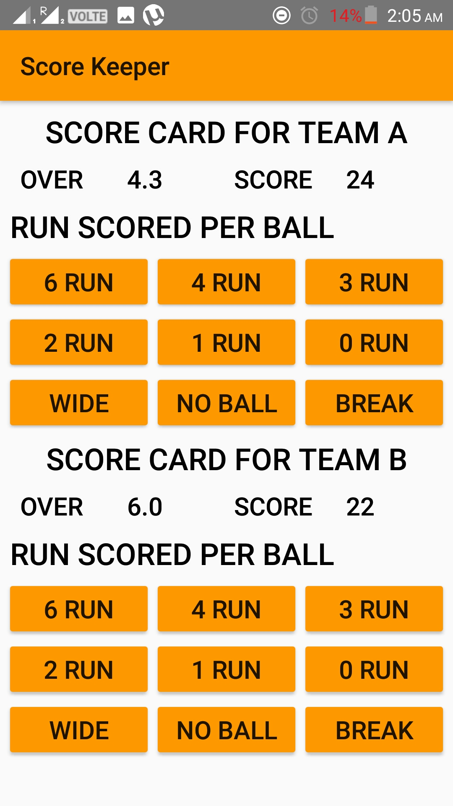
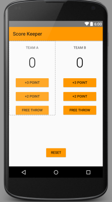
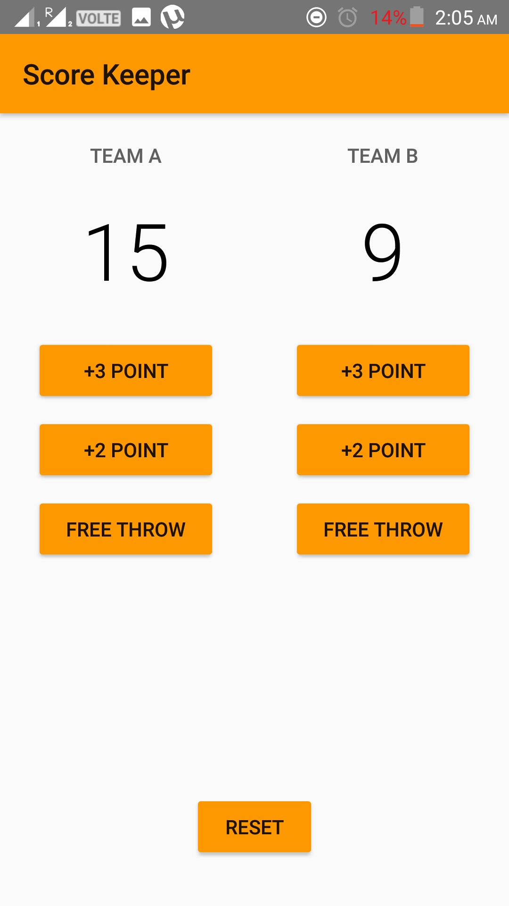

# nanodegree_project2_submission
# Logo 

# Main Screen Layout

# Cricket score layout

# Basket score layout

# androidnanodegree
#Images used may belong to different organisations.
#App Logo belongs to some real world organisation.
#App Name belong to real world organisation.
#MinSdk: API 21: Android 5.0 (Lolipop)
#Target Devide:- Nexus 4 (4.7", 768*12280: xhdpi), API 23
#Tested On-
#         1. Model: Vibe K5 Note
                  Model number: A7020a48
                  Android version: 6.0
          
#          2. Model: Redmi Note3 
                    Android version: 6.0.1
